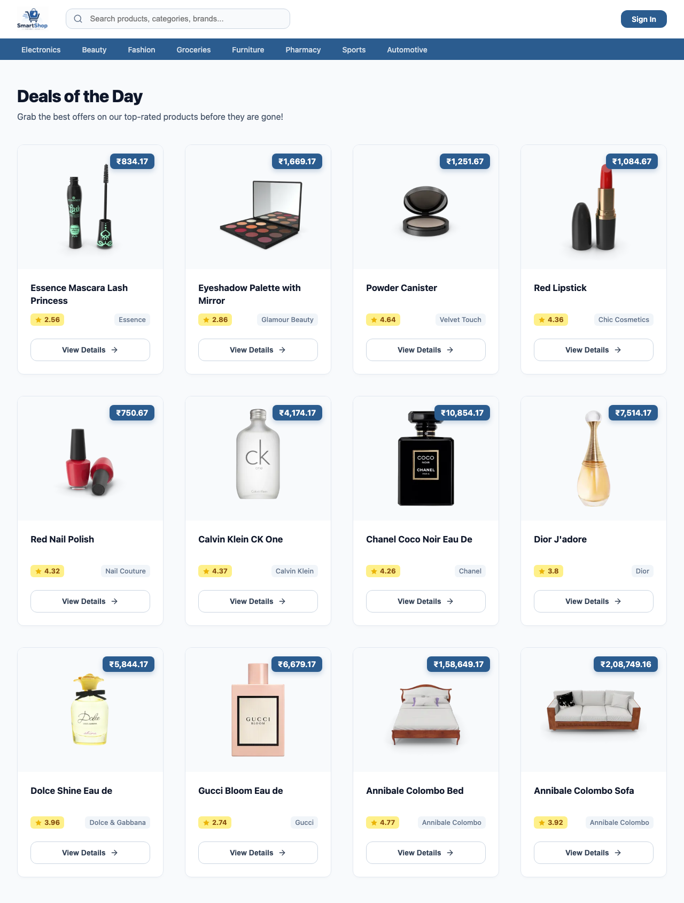
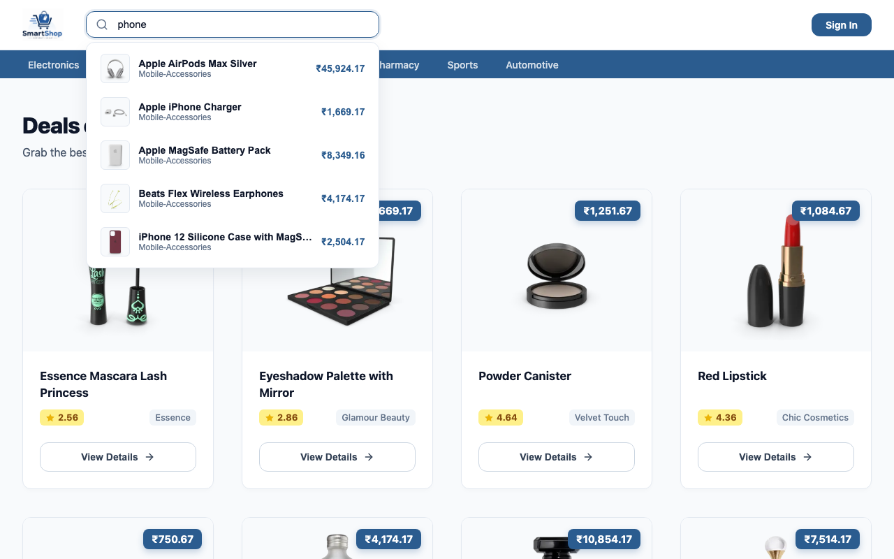
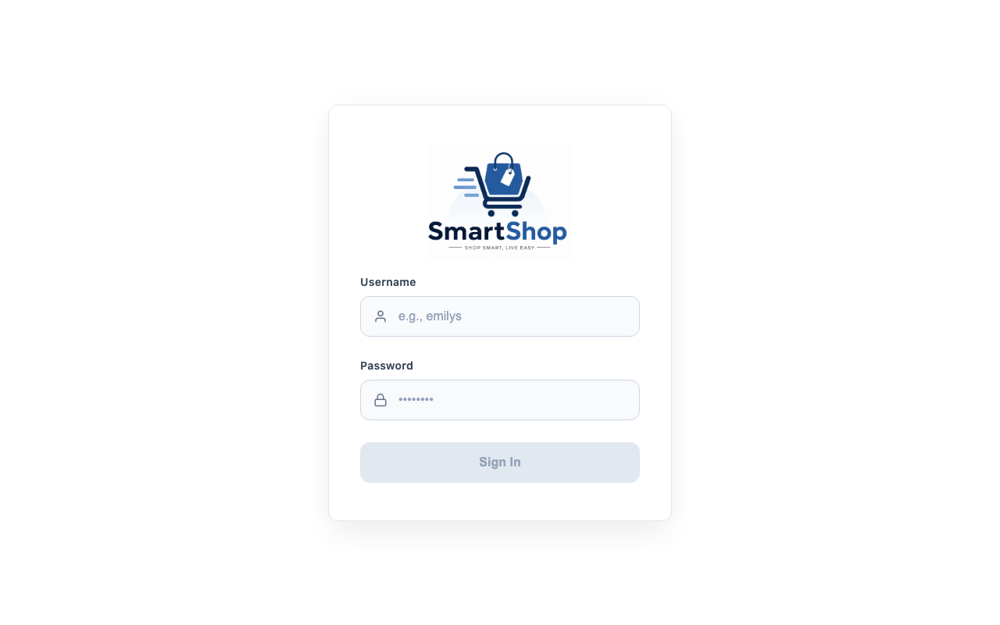
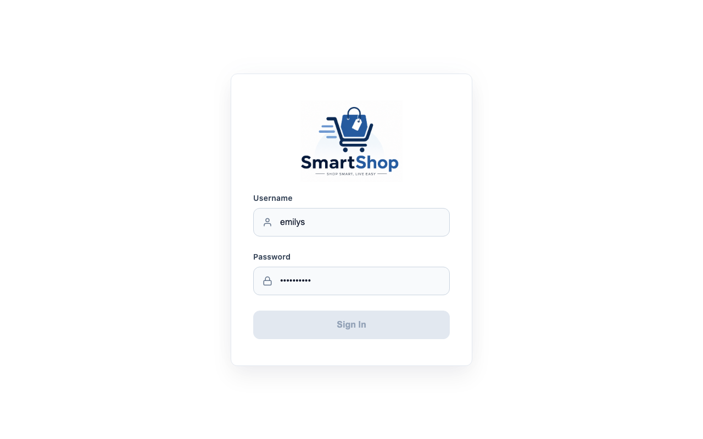
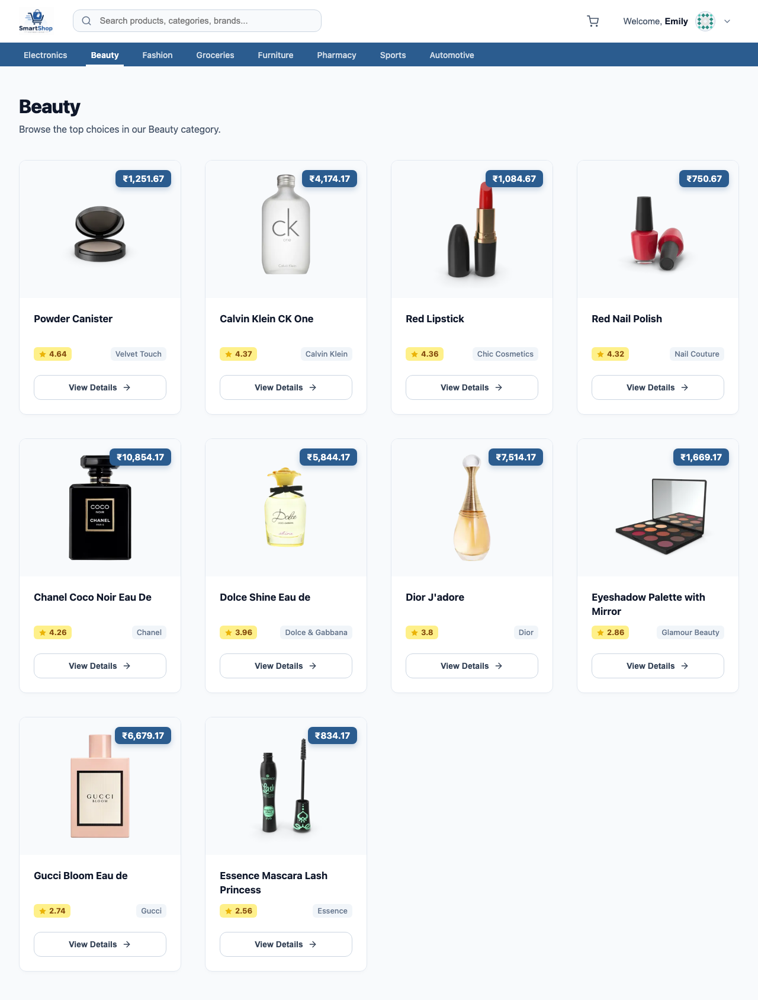
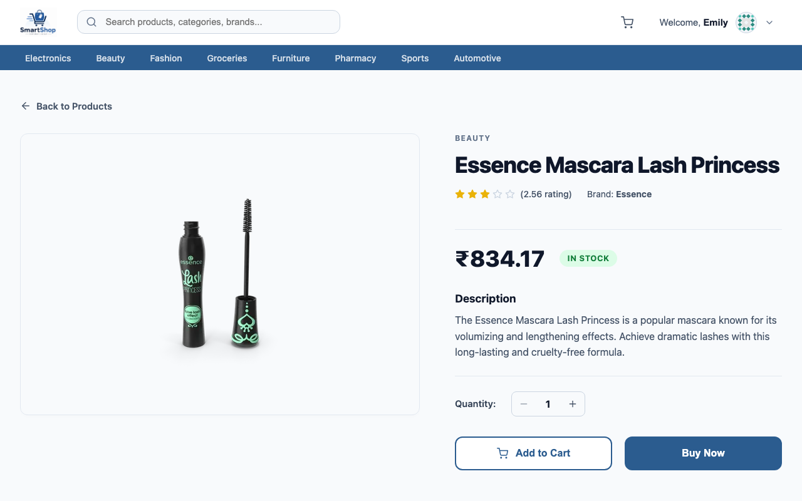
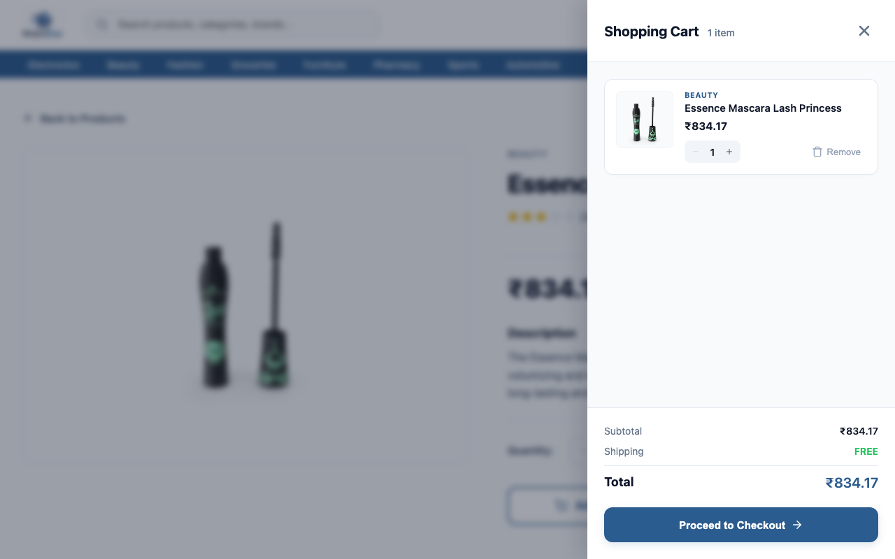
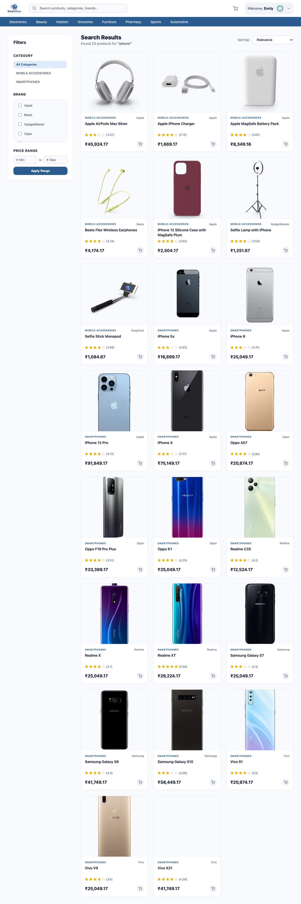
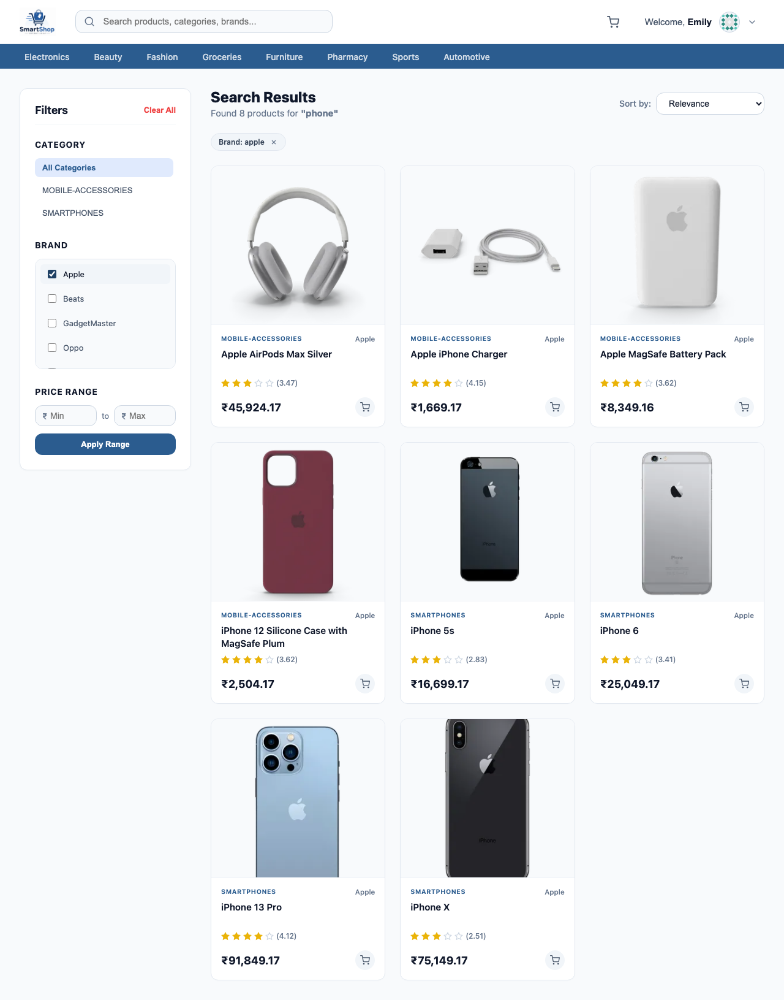
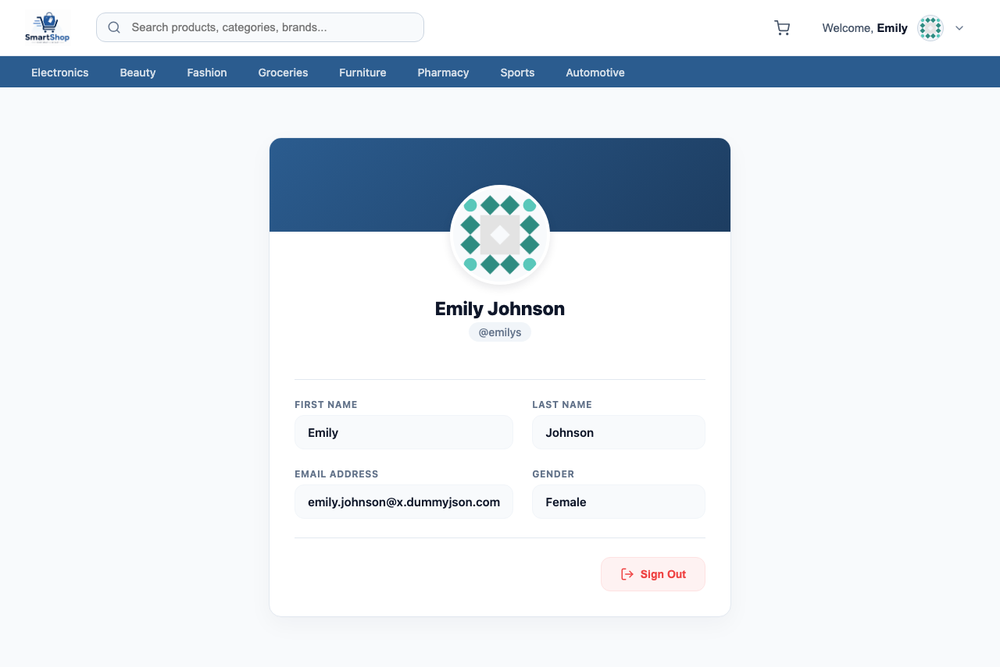

# SmartShop Portal

SmartShop Portal is an Angular-based e-commerce web application featuring live product catalogues, dynamic search recommendations, dynamic frontend checklists and sorting, a reactive shopping cart, and route guards.

---

## Assignment Overview

The objective of this assignment is to build a secure, interactive e-commerce portal in Angular using:
- **Angular CLI & Component Shelling:** Structured into clean components.
- **Dynamic API integration:** Utilizing the public **DummyJSON API** endpoints for authentication, product catalogues, details, and live search.
- **Shared RxJS State Management:** Managing global user authentication context using reactive `BehaviorSubject` streams.
- **Route Protection:** Locking access to authenticated pages using route guards, with redirection recovery.
- **Angular Signals:** Coordinating reactivity for the shopping cart.
- **Precise Currency Conversion:** Building a custom global pipe to translate all native USD prices into Indian Rupees (INR) using `₹` formatting.

---

## Setup & Run Instructions

### Prerequisites
- **Node.js** (v18.x or higher)
- **Angular CLI** (v18.x or higher)

### Starting the SmartShop Application
1. Navigate to the project directory:
   ```bash
   cd angular/smartshop
   ```
2. Install dependencies:
   ```bash
   npm install
   ```
3. Run the development server:
   ```bash
   npm start
   # Or: ng serve
   ```
4. Access the portal at `http://localhost:4200/`. Use demo credentials:
   - **Username:** `emilys`
   - **Password:** `emilyspass`

### Running the Screenshots Automation Script
1. Navigate to the playwright directory:
   ```bash
   cd angular/playwright
   ```
2. Install packages:
   ```bash
   npm install
   ```
3. Run:
   ```bash
   ng serve
   ```
---

## Project Screenshots

The screenshots of the application are saved inside `public/screenshots/`. Here is the step-by-step walkthrough of all pages and features:

<h3>Guest View - Deals of the Day (Unprotected Home)</h3>
<p>Route: <code>/home</code></p>


<h3>Guest View - Autocomplete Search Suggestions</h3>
<p>Route: <code>/home</code></p>


<h3>Search Interception Redirect (Guest sent to Login)</h3>
<p>Route: <code>/login?returnUrl=/search?q=phone</code></p>



<h3>Login Form (Credentials Pre-filled)</h3>
<p>Route: <code>/login</code></p>


<h3>Target Redirect Recovery (Post-Login Category View)</h3>
<p>Route: <code>/products?category=beauty</code></p>



<h3>Product Details (Guarded Route)</h3>
<p>Route: <code>/products/1</code></p>


<h3>Cart Drawer Slide-over Panel</h3>
<p>Route: <code>/products/1</code> (Triggered drawer overlay)</p>


<h3>Search Results View (Guarded Route)</h3>
<p>Route: <code>/search?q=phone</code></p>


<h3>Search Filtering (Checks & price range applied)</h3>
<p>Route: <code>/search?q=phone</code></p>


<h3>User Profile details card (Guarded Route)</h3>
<p>Route: <code>/profile</code></p>


---

## Concepts & Implementation Details

All core architectural and testing requirements are structured under their respective conceptual implementations:

### Angular Routing
- **What is implemented:** Layout shell structuring, path mappings, nested child route layouts, and query parameters extraction.
- **How it is implemented:** Configured in `src/app/app.routes.ts` using Angular's functional router API. The root paths load the `Home` component as a layout shell containing the shared Header and Navbar, and utilizes `<router-outlet>` to load page components (`ProductList`, `ProductDetails`, `SearchComponent`, `Profile`) dynamically. Navigation triggers use `[routerLink]` bindings and programmatic `this.router.navigate(...)` / `this.router.navigateByUrl(...)` calls.

### Dashboard Segmentation as Home
- **What is implemented:** Segmenting the user's primary panel. Instead of a single heavy page, the dashboard is segmented into the parent `Home` shell layout and child components (Header, Navbar, and content container) rendering:
  - Deals of the Day (mixed product feed)
  - Dynamic category listings
  - Shopping Cartdrawer panel
  - User Profile details card
- **How it is implemented:** Implemented using Angular nested route hierarchy. The `Home` layout component acts as the root shell that displays the persistent `Header` (which coordinates personalized greeting and cart options) and the categories selection `Navbar`. It contains the main `<router-outlet>` to dynamically switch sub-segmented layouts (`ProductList`, `ProductDetails`, `SearchComponent`, `Profile`) inside the content grid container based on active routes.

### Inter-component Communication
- **What is implemented:** Sharing authenticated user context and coordinating real-time updates for shopping cart counts, quantities, items, and drawer toggling.
- **How it is implemented:** Handled through shared injectable services:
  - `AuthService` communicates the authentication state from the `Login` component to the `Header` and `Profile` views.
  - `CartService` manages the shopping cart array, computed totals, and drawer overlay triggers using Angular Signals (`signal`, `computed`). Components like `ProductDetails` or `SearchComponent` trigger item additions directly, automatically sliding open the global `Cart` overlay drawer.

### API calls using DummyJSON
- **What is implemented:** Live data fetching for signing in users, requesting combined categorised catalogs, querying specifications for product details, and retrieving search queries.
- **How it is implemented:** Uses Angular's `HttpClient` inside services to communicate with external JSON endpoints:
  - User Login: `POST https://dummyjson.com/auth/login`
  - Catalogs & Category Lists: `GET https://dummyjson.com/products` and `/category/{slug}`
  - Single Product details: `GET https://dummyjson.com/products/{id}`
  - Autocomplete & search matches: `GET https://dummyjson.com/products/search?q={query}`

### RxJS usage
- **What is implemented:** Authentication user state broadcast streams, API operators piping, and auto-suggest search debouncing.
- **How it is implemented:**
  - Implements `BehaviorSubject<User | null>` in `AuthService` to hold user sessions, exposed as a read-only `Observable` (`currentUser$`) and consumed in templates via the `async` pipe.
  - Employs RxJS operators like `tap`, `map`, and `catchError` inside services to transform raw data, handle caching, and throw errors.
  - Utilizes a `Subject<string>` in `Header` combined with pipeline operators `debounceTime(300)`, `distinctUntilChanged()`, and `switchMap()` to handle input-driven search recommendations dynamically.

### Login-based personalized salutation
- **What is implemented:** Renders personalized greetings for authenticated users inside the header while hiding user-only indicators for unauthenticated guests.
- **How it is implemented:** The Header component templates consume the `currentUser$` observable using an `@if (currentUser$ | async; as user)` control structure. When login occurs, it dynamically prints `"Welcome, <firstName>"` and shows their profile avatar. If logged out, it hides the profile dropdown and cart triggers, showing only a **Sign In** action.

### Route protection using Auth Guard
- **What is implemented:** Locking child views (product details, search results, profile cards) from guest users while keeping the primary home catalog list unprotected.
- **How it is implemented:** Implemented inside `src/app/guards/auth.guard.ts` as a functional route guard `authGuard` using the `CanActivateFn` API. Unauthenticated requests are blocked and redirected to the `/login` route, passing the original path as a `returnUrl` parameter. Upon successful login, the application redirects them back to their requested page.

### Custom Pipes
- **What is implemented:** Conversion and format rendering of native USD prices to Indian Rupees (INR) across the catalog, detail descriptions, search lists, and cart drawers.
- **How it is implemented:** Implemented in `src/app/pipes/inr-currency.pipe.ts` as `InrCurrencyPipe`. It exports a global conversion function `usdToInr` (multiplying values by `83.5` rupees per USD) and formats them with `toLocaleString('en-IN')` to append `₹` and apply Indian currency grouping.

### Angular Signals
- **What is implemented:** Fine-grained reactive state tracking for global user shopping cart actions, component lifecycle states (loading, errors), product quantities, active gallery views, search settings, and dynamic client-side filtering.
- **How it is implemented:** Signals are utilized extensively across the codebase to manage state reactively:
  - **Shared Cart Context (`src/app/services/cart.service.ts`):** Exposes `cartItems` as a read-only signal, uses `computed` signals (`cartCount`, `cartTotal`) to dynamically compile aggregates, and manages the drawer open/close toggles.
  - **Product List Views (`src/app/components/product-list/product-list.ts`):** Employs signals to track the current active category, loaded product arrays, and skeleton shimmer loading indicators.
  - **Product Details View (`src/app/components/product-details/product-details.ts`):** Uses signals to manage the loaded single product details, the actively selected gallery thumbnail image, error banners, and the item purchase quantity counter.
  - **Search Panel View (`src/app/components/search/search.ts`):** Stores query parameters (active keyword query, category slugs, price thresholds, active sort order) as signals, and uses `computed` signals to compile dynamic sidebar filters (available categories, brands checklist) and perform in-memory filtering/sorting reactively.
