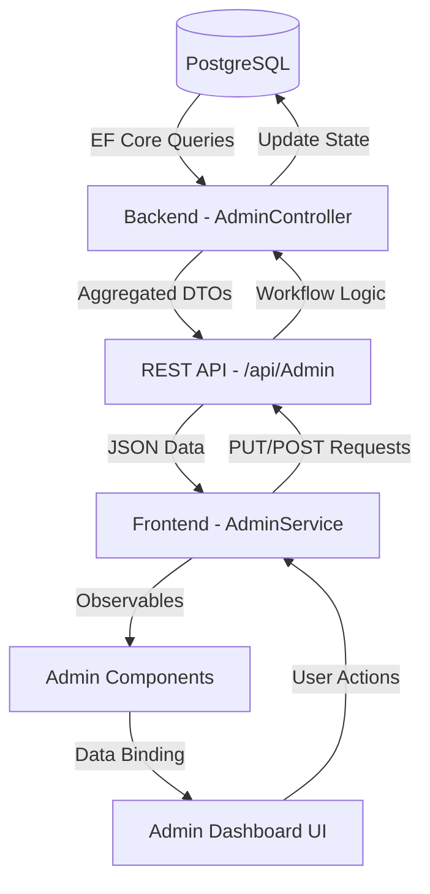

# Admin Module Documentation - Bus Reservation System

This document serves as the comprehensive technical reference and implementation blueprint for the Admin Module.

## 1. High-Level Workflow & Data Flow

The Admin Module provides centralized control over platform financials, operations, and partner management.

### Workflow Diagram

### Data Synchronization Flow
1. **Request**: Admin selects a date range and operator filter in the UI.
2. **Backend Aggregation**: The `AdminController` executes multi-layer LINQ queries to sum revenue and count bookings.
3. **Business Logic**: Revenue is derived using `GlobalConfiguration` (fees/commissions).
4. **Response**: A single `AdminStatsDto` provides all metrics and the filtered trip activity list.
5. **Reactive UI**: The Angular frontend utilizes `ChangeDetectorRef` to ensure the dashboard reflects the new data immediately.

---

## 2. Feature Breakdown

### A. Admin Dashboard (Metrics & Analytics)
*   **Purpose**: Provides an at-a-glance health check of the platform's performance.
*   **Metrics**: 
    *   **Total Bookings**: Count of all successful transactions in the selected range.
    *   **Revenue Metrics**: Gross Booking Revenue, Net Revenue (Platform Share), and Operator Payout.
    *   **Activity Monitoring**: Counts of Upcoming vs. Completed trips.
*   **Internal Logic**: Uses `IQueryable` projections to avoid pulling raw data into memory.
*   **Components**: `AdminHomeComponent`, `AdminService`.

### B. Financial Reporting & Revenue Calculation
*   **Gross Booking Revenue**: `Sum(BasePrice + PlatformFee)` for all confirmed bookings.
*   **Net Revenue**: `PlatformFee + (BasePrice * Commission%)`. This represents the platform's actual earnings.
*   **Operator Payout**: `Gross Revenue - Net Revenue`. The amount owed to the bus partners.
*   **Rules**: Calculations are authoritative on the backend, derived from the `GlobalConfiguration` table.

### C. Platform Trip Activity Monitoring
*   **Status Classification**:
    *   **Upcoming**: `DepartureTime > Now` and not cancelled.
    *   **Completed**: `ArrivalTime < Now` and not cancelled.
    *   **Cancelled**: Explicitly marked as cancelled in the `Status` column.
*   **Occupancy Tracking**: Real-time calculation of `BookedSeats / MaxSeats` per journey.
*   **Filters**: Full support for Date Range, Operator, and Categorical filtering (e.g., "Most Cancelled").

### D. Operator Management & Approvals
*   **Deactivation Workflow**: When deactivated, the system automatically cancels all future trips for that operator and initiates customer refunds via the `OperatorWorkflowService`.
*   **Reactivation**: Restores operator status and sends a notification email.

### E. Fleet Approval Workflow
*   **Purpose**: Ensures all vehicles meet platform standards before being searchable.
*   **Workflow**: Operator adds bus → Admin notified → Admin approves/rejects → Operator notified.
*   **Gatekeeper**: Approved buses are the only vehicles selectable in the "Schedule Trip" flow.

### F. Route Management (Master Data)
*   **Authority**: Admin is the sole creator of Routes (Source ↔ Destination).
*   **Data Points**: Source City, Destination City, and Distance in KM.

---

## 3. System Architecture (File Breakdown)

### Frontend (Angular)
| File | Purpose | Key Functions |
| :--- | :--- | :--- |
| `admin.service.ts` | Central data provider for all admin modules. | `getStats()`, `activateOperator()`, `updateFeeSettings()` |
| `admin-home.component.ts` | Main dashboard view with metrics and trip activity list. | `loadStats()`, `applyFiltersAndSorting()` |
| `fee-settings.component.ts` | Interface for managing platform fees and commissions. | `saveSettings()` |
| `operator-approvals.component.ts` | Table for managing operator status (Approve/Deactivate). | `activate()`, `deactivate()` |
| `location-master.component.ts` | Transformed into **Route Management** dashboard. | `loadRoutes()`, `addRoute()` |

### Backend (.NET 8 Core)
| File | Purpose | Endpoints |
| :--- | :--- | :--- |
| `AdminController.cs` | Main API controller for metrics and master data. | `GET /stats`, `POST /routes`, `PUT /buses/{id}/approve` |
| `AdminDtos.cs` | Data Transfer Objects for optimized API responses. | `AdminStatsDto`, `RouteResponseDto`, `BusApprovalDto` |
| `OperatorWorkflowService.cs` | Encapsulates complex logic for operator lifecycle events. | `DeactivateOperatorAsync()`, `ReactivateOperatorAsync()` |

---

## 4. Database Schema (Admin Perspective)

### Core Tables
1.  **`Schedules`**: The primary source for trip activity. Contains `DepartureTime`, `ArrivalTime`, `BusId`, and `Status`.
2.  **`Bookings`**: Tracks financial commitments. Linked to `Schedules` and `Payments`.
3.  **`BusOperators`**: Stores company details and `IsApproved` status.
4.  **`GlobalConfigurations`**: Singleton table storing the platform fee structure (Fixed vs. Percentage) and commission rates.
5.  **`Payments`**: Tracks the status of transactions (`Success`, `Refunded`).

### Key Relationships
*   `Booking` → `Schedule` (Many-to-One): Identifies which trip the revenue belongs to.
*   `Schedule` → `Bus` → `BusOperator`: Allows filtering financials and trips by operator.
*   `Booking` → `Passenger` (One-to-Many): Used to calculate seat occupancy.

---

## 5. API Reference

### `GET /api/Admin/stats`
*   **Query Params**: `startDate`, `endDate`, `operatorId`
*   **Response**: `AdminStatsDto` (Metrics + List of `AdminTripDto`)
*   **Purpose**: Power the main dashboard view.

### `PUT /api/Admin/settings/fee`
*   **Body**: `{ feeType, feeValue, commissionPercentage }`
*   **Purpose**: Update platform-wide financial rules.

### `PUT /api/Admin/operators/{id}/activate`
*   **Purpose**: Restore access for a deactivated operator.

### `POST /api/Admin/routes`
*   **Body**: `{ source, destination, distanceKm }`
*   **Purpose**: Define a new travel route on the platform.

### `PUT /api/Admin/buses/{id}/approve`
*   **Purpose**: Authorize a pending bus for scheduling.

---

## 6. Implementation Details & Rules

### Revenue Rules
*   Platform Fee is applied per booking.
*   Operator Commission is calculated as a percentage of the base price (excluding fees).
*   Refunds: When an operator is deactivated, all `Success` payments for future trips are flipped to `Refunded`.

### Sorting & Filtering
*   Frontend sorting is performed in-memory on the `recentTrips` array (limit 5000) for instant performance.
*   Backend filtering is strict: `DepartureTime >= Start AND DepartureTime <= End`.

---

## 7. Known Limitations & Future Improvements

### Limitations
*   **In-Memory Sorting**: While fast, it depends on the 5000-record limit from the backend. For extremely high-volume systems, server-side sorting should be implemented.
*   **Refund Processing**: Currently marks payments as "Refunded" in the DB; actual payment gateway integration for refunds is pending.

### Suggested Improvements
*   **Dashboard Visualizations**: Implement Chart.js or D3.js to show revenue trends over time.
*   **Audit Logs**: Track which administrator changed platform fees or deactivated an operator.
*   **Batch Approvals**: Allow approving multiple operators at once.

---
*Generated by Antigravity AI - Internal Implementation Blueprint*
