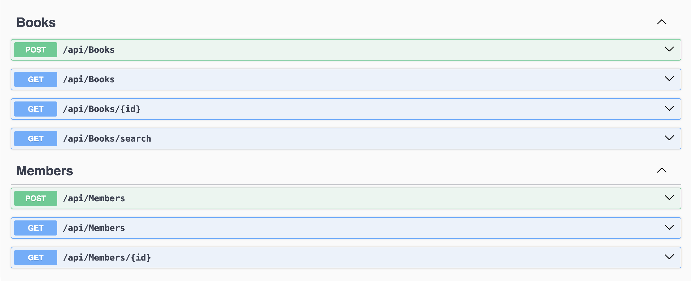
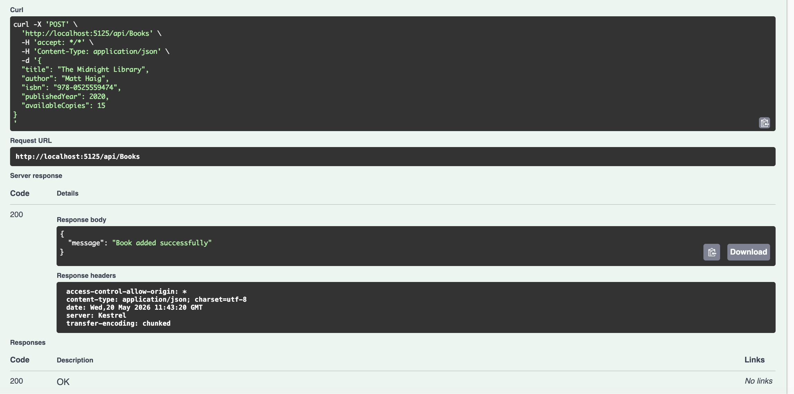
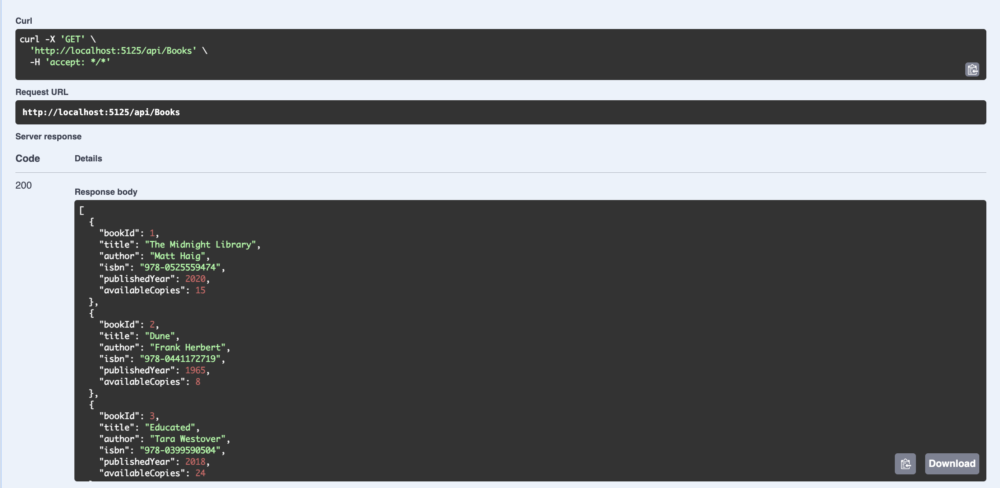
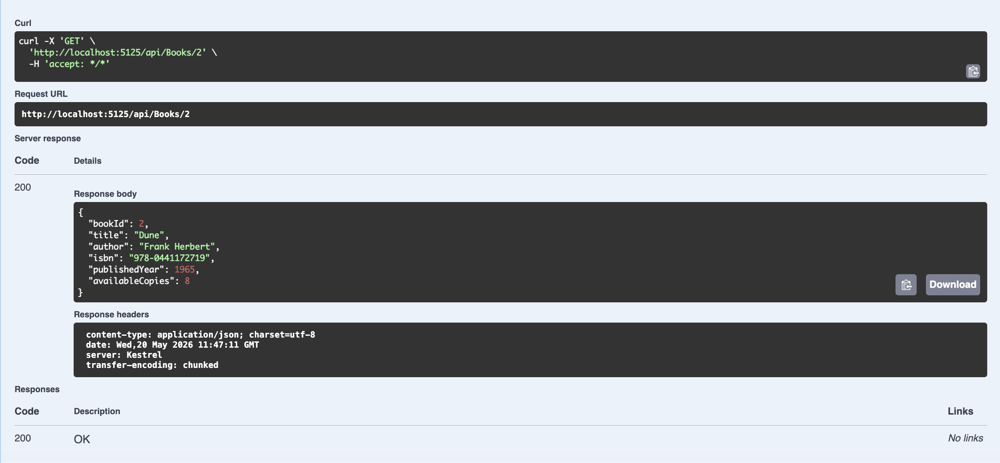
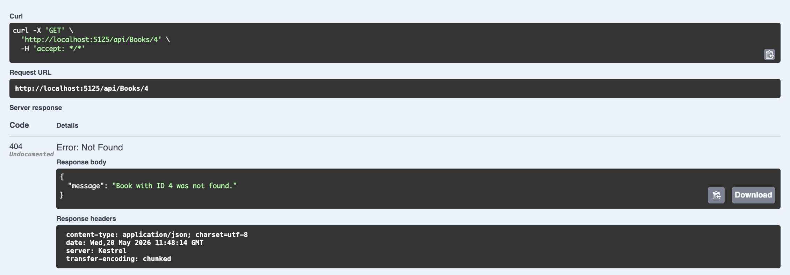
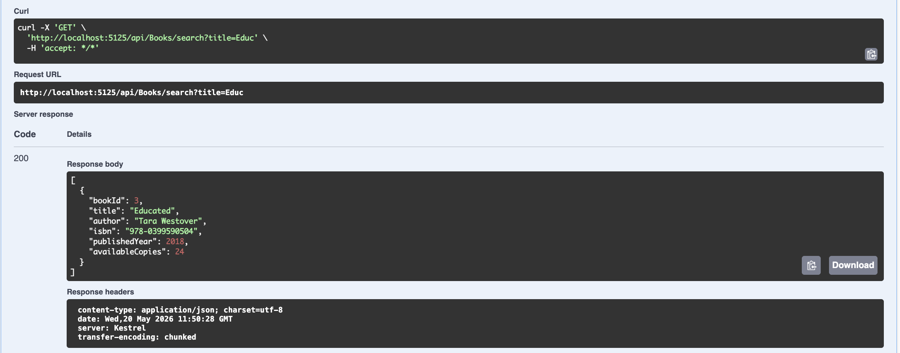
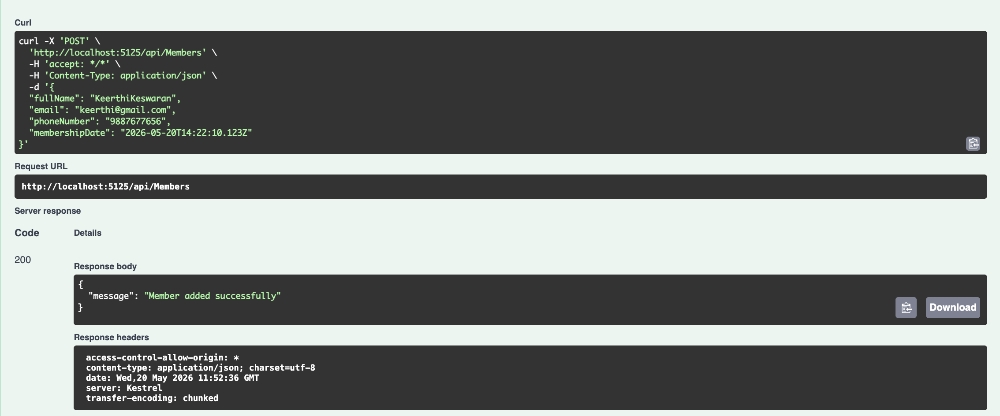
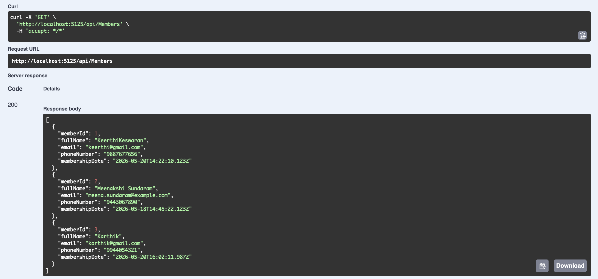
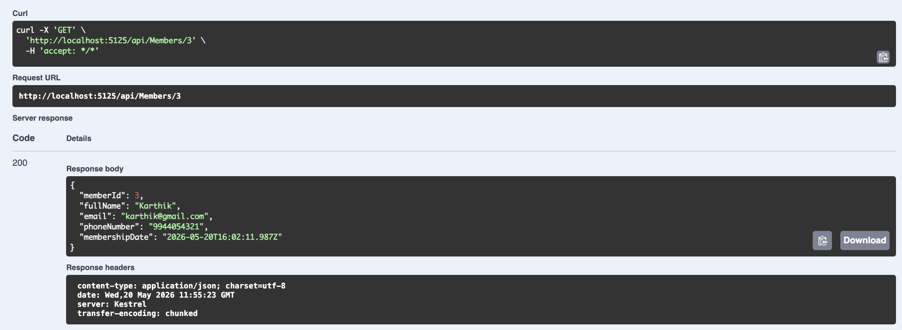
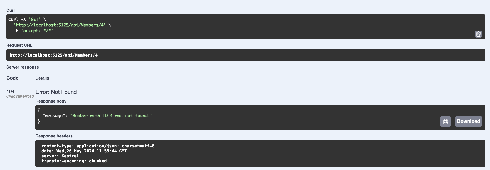

# Library System API

This project implements an ASP.NET Core Web API for managing books and members in a library system. Built using a clean layered architecture with PostgreSQL and Entity Framework Core.

## Features
- Add and retrieve books
- Search books by title
- Add and retrieve members
- Validation and error handling (returns 404 for missing resources)

## Getting Started

### 1. Database Setup
Create or update the `appsettings.json` file inside the `LibrarySystem.API` directory and add your PostgreSQL connection string:

```json
{
  "ConnectionStrings": {
    "DefaultConnection": "Host=localhost;Port=5432;Database=library_api_db;Username=your_username;Password=your_password"
  }
}
```

Apply the database migrations to create the tables:
```bash
dotnet ef database update --project LibrarySystem.Data --startup-project LibrarySystem.API
```

### 2. Running the API
To run the API locally:
```bash
dotnet run --project LibrarySystem.API
```
The Swagger UI will be available at `http://localhost:5125/swagger/index.html`.

## Folder Structure

```text
library-system-api/
├── LibrarySystem.API/              # API presentation layer (entry point)
│   ├── Controllers/                # API controllers (BooksController, MembersController)
│   ├── Program.cs                  # App configuration, dependency injection, and middleware
│   └── appsettings.json            # Database connection strings and app settings
├── LibrarySystem.Business/         # Business logic layer
│   ├── Services/                   # Business services implementing validation and exceptions
│   └── Exceptions/                 # Custom domain exceptions (NotFoundException, ValidationException)
├── LibrarySystem.Contracts/        # Interfaces and contracts
│   └── Interfaces/                 # Repository and Service interfaces
├── LibrarySystem.Data/             # Data access layer
│   ├── Contexts/                   # EF Core DbContext (LibraryDbContext)
│   ├── Repositories/               # Data access implementations (BookRepository, MemberRepository)
│   └── Migrations/                 # EF Core database schema migrations
└── LibrarySystem.Models/           # Data models and DTOs
    ├── Models/                     # Core domain database entities (Book, Member)
    └── DTOs/                       # Data Transfer Objects (BookRequest, BookResponse, etc.)
```

## API Documentation and Screenshots

### Swagger UI Overview


### Add Book
**POST** `/api/books`


### Get All Books
**GET** `/api/books`


### Get Book By Id (Success)
**GET** `/api/books/{id}`


### Get Book By Id (Not Found)
**GET** `/api/books/{id}`


### Search Books By Title
**GET** `/api/books/search?title=clean`


### Add Member
**POST** `/api/members`


### Get All Members
**GET** `/api/members`


### Get Member By Id (Success)
**GET** `/api/members/{id}`


### Get Member By Id (Not Found)
**GET** `/api/members/{id}`

