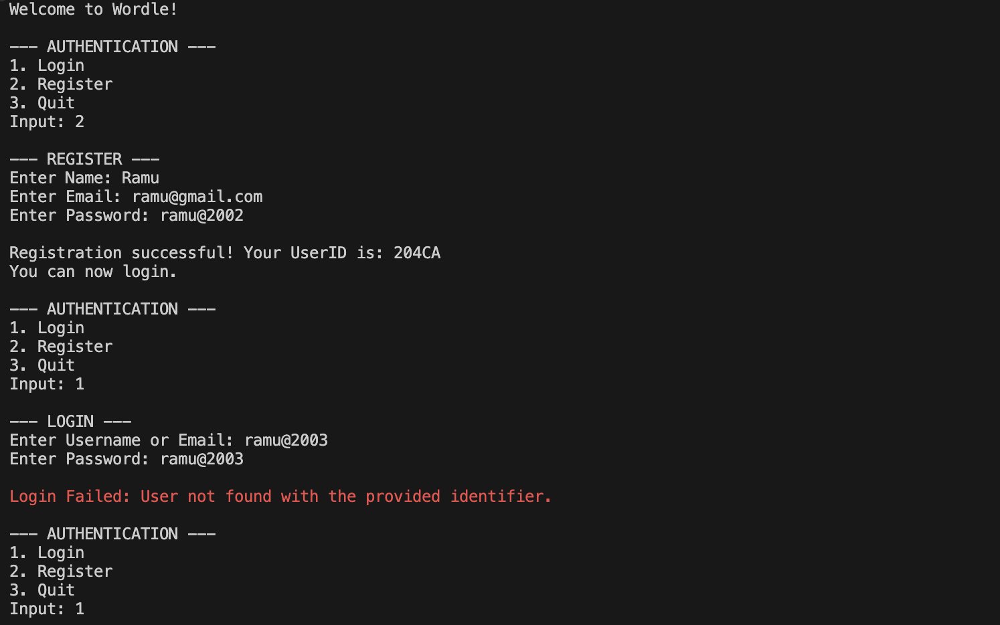
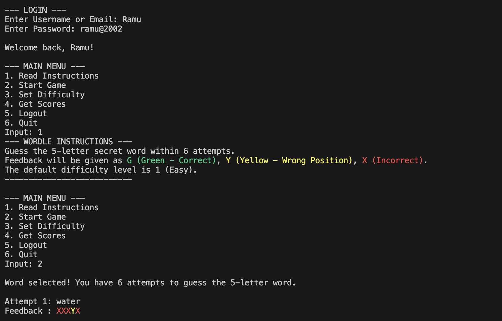
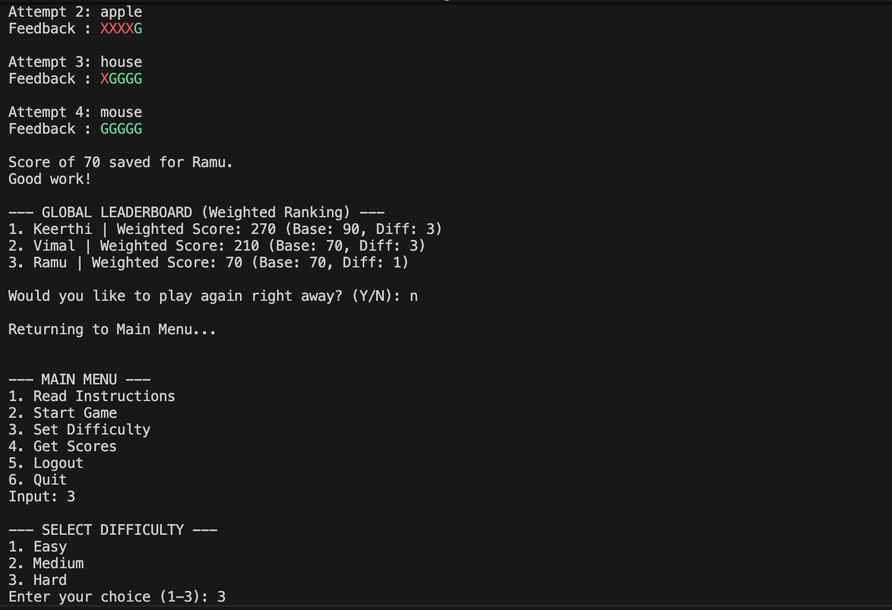
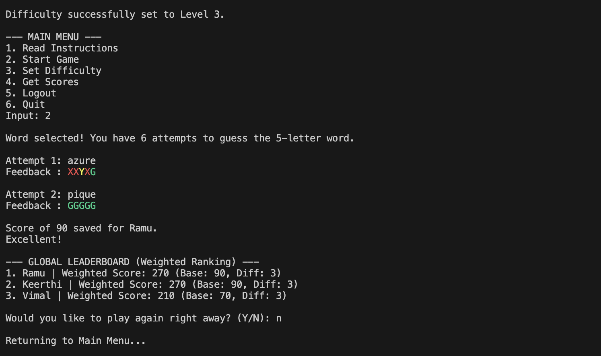
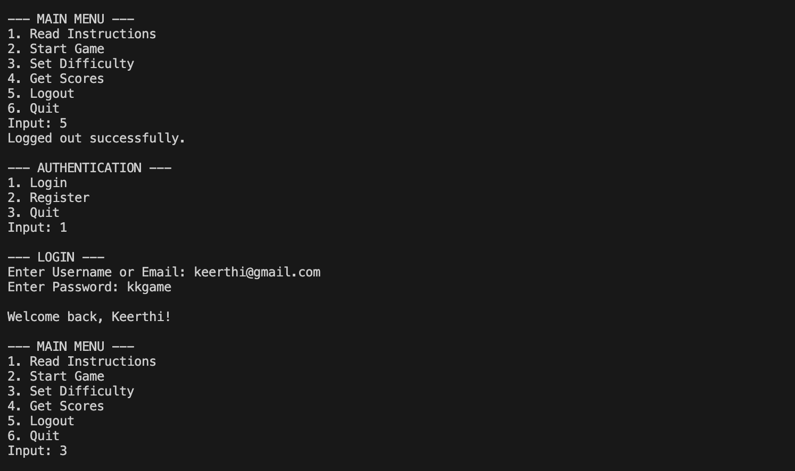
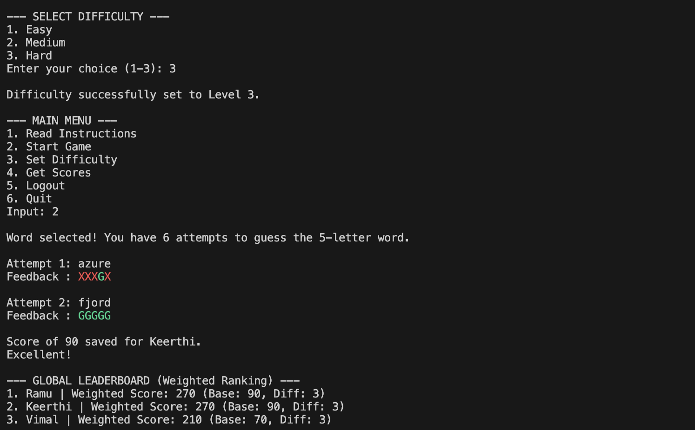
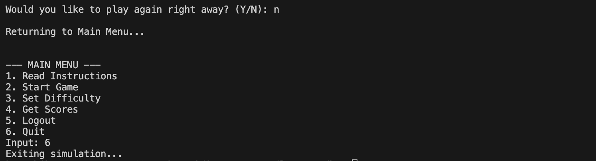

# Wordle - ADO.Net Integrated Version

A robust, relational version of the classic Wordle game built using **C#**, **ADO.NET**, and **PostgreSQL**. This project features a persistent data layer, secure authentication, and a weighted ranking system.

---

## Features

- **Relational Data Persistence**: All words, users, and scores are stored in a PostgreSQL database.
- **Secure Authentication**: 
  - Login/Register system with password hashing (SHA-256).
  - Unique 5-character UserID generation : combined hashing of name and email.
- **Dynamic Word Selection**: Fetches words from a normalized database table based on three difficulty levels.
- **Core Game Logic**:
  - **Feedback System**: Standard Wordle rules with Green (Correct), Yellow (Wrong Position), and Red (Incorrect) feedback.
  - **Attempts**: 6 attempts per game.
- **Advanced Scoring & Ranking**:
  - **Proportional Scoring**: High reward for early guesses. 100 points for 1st attempt, dropping proportionally to 16 points for the 6th attempt.
  - **Weighted Ranking**: The leaderboard ranks users by `Score * Difficulty`, ensuring high-difficulty wins are valued more.
  - **Global Leaderboard**: Shows the single highest weighted score for every unique user.
- **Custom Exception Handling**: Dedicated exceptions for authentication failures, duplicate users, and invalid game inputs.

---

##  Database Schema

The system uses three normalized tables:

### 1. `users`
| Column | Type | Description |
| :--- | :--- | :--- |
| `user_id` | `VARCHAR(5)` | Primary Key (Unique ID) |
| `name` | `VARCHAR(100)` | User's name |
| `email` | `VARCHAR(100)` | Unique Email |
| `password_hash` | `TEXT` | Hashed password |

### 2. `words`
| Column | Type | Description |
| :--- | :--- | :--- |
| `word_id` | `SERIAL` | Primary Key |
| `difficulty` | `INT` | 1 (Easy), 2 (Medium), 3 (Hard) |
| `word_text` | `VARCHAR(100)` | The 5-letter word |

### 3. `scores`
| Column | Type | Description |
| :--- | :--- | :--- |
| `score_id` | `SERIAL` | Primary Key |
| `user_id` | `VARCHAR(5)` | Foreign Key to `users` |
| `score_value` | `INT` | Base score (0-100) |
| `difficulty` | `INT` | Difficulty level |
| `played_at` | `TIMESTAMP` | Timestamp of the game |

---

##  Setup Instructions

### 1. Prerequisites
Ensure you have the following installed:
- .NET 6.0 SDK or later
- PostgreSQL Database

### 2. Required Packages
Install the following NuGet packages:
```bash
dotnet add package Npgsql
dotnet add package Microsoft.Extensions.Configuration
dotnet add package Microsoft.Extensions.Configuration.Json
```

### 3. Configuration
Create an `appsettings.json` file in the project root:
```json
{
  "ConnectionStrings": {
    "DefaultConnection": "Host=localhost;Database=wordgame;Username=your_user;Password=your_password"
  }
}
```
*Make sure to update the `wordle-game.csproj` to ensure this file is copied to the output directory.*

### 4. SQL Initialization
Run the following script to set up your tables:
```sql
CREATE TABLE users (
    user_id VARCHAR(5) PRIMARY KEY,
    name VARCHAR(100) NOT NULL,
    email VARCHAR(100) UNIQUE NOT NULL,
    password_hash TEXT NOT NULL
);

CREATE TABLE words (
    word_id SERIAL PRIMARY KEY,
    difficulty INT NOT NULL,
    word_text VARCHAR(100) NOT NULL
);

CREATE TABLE scores (
    score_id SERIAL PRIMARY KEY,
    user_id VARCHAR(5) REFERENCES users(user_id),
    score_value INT NOT NULL,
    difficulty INT NOT NULL,
    played_at TIMESTAMP DEFAULT CURRENT_TIMESTAMP
);
```

---

##  Outputs

<p align="center" style="margin: 0; padding: 0;">
  
  
  
  
  
  
  
</p>


---

## Project Structure

- **Program.cs**: Entry point with authentication and game loops.
- **Repositories/**: ADO.NET data access layer using Npgsql.
- **Services/**: Business logic for game operations, feedback, and validation.
- **Models/**: Data structures for Users, Scores, and the Game state.
- **Exceptions/**: Custom domain-specific exceptions.
- **Interfaces/**: Decoupled contracts for services and repositories.
