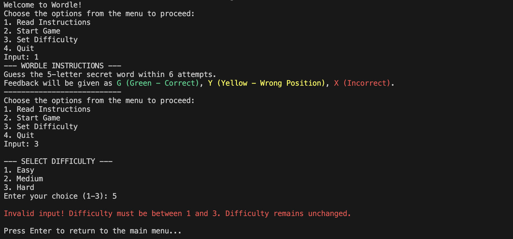
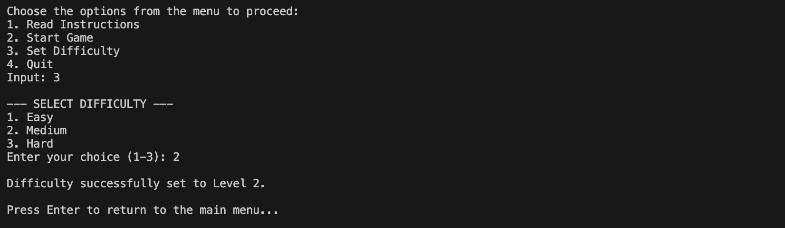
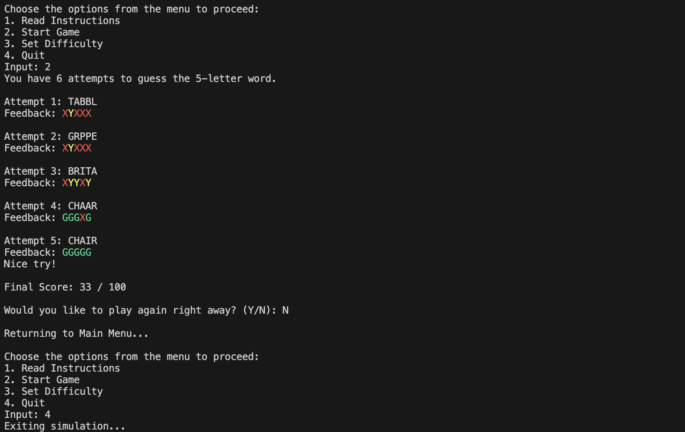

# 🟩 🟨 ⬛ Console Wordle

Welcome to the ultimate C# Console Wordle Game! This project brings the addictive word-guessing phenomenon straight to your terminal, completely rebuilt from the ground up using strict, professional Object-Oriented Programming (OOP) principles. 

Whether you're a casual player looking for a quick brain teaser or a developer who loves clean architecture, this game is built to deliver a smooth, colorful, and highly interactive experience!

## ✨ Features at a Glance

* **🎨 Colorized Visual Feedback:** Immerse yourself in the classic Wordle aesthetic right in your console! Watch correct letters light up in bright **Green**, misplaced letters glow in **Yellow**, and wrong guesses fade to **Red**. 
* **🎚️ Dynamic Difficulty Levels:** Choose your challenge! The game dynamically pulls from curated word lists. Start on **Easy** to warm up, or jump into **Hard** if you're ready to rack your brain.
* **🛡️ Bulletproof Validation:** The game protects itself. Blank guesses, numbers, special characters, and accidental duplicate guesses are instantly caught and rejected—and you won't even lose an attempt!
* **⚡ Rapid Replay Loop:** Finished a game? Hit `Y` to instantly launch back into the action on your current difficulty without having to navigate back to the main menu.
* **💯 Performance Scoring:** After each game, receive a mathematical performance score out of 100 based on how few attempts it took you to crack the secret word!

## 🏗️ Architecture & OOP Design

Under the hood, this application is a powerhouse of software engineering best practices:
* **Data Privacy (Encapsulation):** The Secret Word is strictly private and locked deep within the `GameModel`. Even the main `GameService` doesn't know what the word is—it can only ask the Model to evaluate a user's guess!
* **Dependency Inversion (Interfaces):** All services (`GameService`, `WordService`, etc.) implement formal interfaces (`IGameService`, `IWordService`) to ensure the architecture remains loosely coupled, modular, and highly testable.
* **Separation of Concerns:** The application cleanly separates pure data objects (`Models/`) from the heavy-lifting business logic (`Services/`).
* **Single Responsibility Principle:** Core game loop logic is managed by `GameService.cs`, while all console user interactions (like menus, difficulty selectors, and outputting scores) are segregated into a partial class, `GameService.Interactions.cs`.
* **Custom Exception Handling:** Robust error management is handled through custom classes like `InvalidGuessException` and `InvalidDifficultyException`, allowing the game loop to gracefully recover from user mistakes instead of crashing.

## 🚀 How to Play

1. Open your terminal and navigate to the project directory.
2. Fire it up by typing: `dotnet run`
3. Set your difficulty from the Main Menu.
4. Start guessing! You have exactly 6 attempts to deduce the hidden 5-letter word.

## 📸 Output

  
  
  

