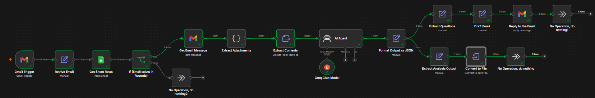
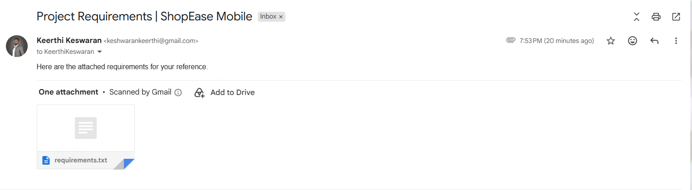
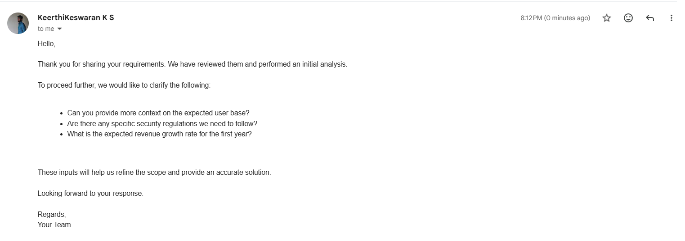

# Requirements Analyst AI Agent

An automated, intelligent email-processing and requirements-analysis agent built with **n8n** and powered by **Groq LLM**. The agent automatically detects client requirement emails, extracts text attachments, performs a structured Business Analysis (BA) using a specialized prompt, drafts a professional response email, and archives the analysis results.

---

## Scenario & Overview

When a client sends an email containing project requirements as a text attachment (e.g., `requirements.txt`), the automation:
1. **Triggers** upon receiving a new email.
2. **Filters** the sender against an authorized database (Google Sheets).
3. **Downloads & extracts** the attached text file containing raw requirements.
4. **Analyzes** the requirements using an AI Agent (configured with a Groq Chat Model) to generate:
   - **Functional Requirements**
   - **Non-Functional Requirements**
   - **Risks** (Technical, Operational, Business)
   - **Assumptions**
   - **Questions to the Client**
5. **Formats & splits** the AI response to:
   - Save the analysis report (`analysis.txt`).
   - Draft and send a professional reply email directly back to the client.

---

## Architecture & Workflow

### Workflow Diagram

```text
[ Gmail Trigger ]
       │
       ▼
[ Get Sheet Rows ] ──────────────┐
  (read: sheet)                  │
                                 ▼
                     ┌──[ If (Email exists in Records) ]
                     │                   │
                  ( true )            ( false )
                     │                   │
                     ▼                   ▼
             [ Get Email Message ]   [ No Operation, do nothing2 ]
               (get: message)
                     │
                     ▼
            [ Extract Attachments ]
                     │
                     ▼
            [ Extract Contents ]
          (Extract From Text File)
                     │
                     ▼
             ┌──────────────┐
             │   AI Agent   │◀─────── [ Groq Chat Model ]
             └──────────────┘
                     │
                     ▼
          [ Format Output as JSON ]
                   (manual)
                     │
         ┌───────────┴───────────┐
         │                       │
         ▼                       ▼
[ Extract Questions ]   [ Extract Analysis Output ]
     (manual)                (manual)
         │                       │
         ▼                       ▼
  [ Draft Email ]        [ Convert to File ]
     (manual)             (Convert to Text File)
         │
         ▼
[ Reply to the Email ]
   (reply: message)
```

---

## Step-by-Step Node Implementation Details

### 1. Gmail Trigger
*   **Purpose:** Listens to the Gmail account and triggers the workflow whenever a new email is received.
*   **Filtering:** Listens to the inbox or specific folders to ensure execution starts on incoming client inquiries.

### 2. Authorization Filter (Google Sheets & Conditional Logic)
*   **Get Sheet Rows:** Fetches the list of registered clients/emails from a Google Sheet database.
*   **If (Email exists in Records):** Performs a conditional check (`true`/`false`).
    *   If **true**, it proceeds to retrieve the full email message.
    *   If **false**, it terminates execution silently (`No Operation`), preventing unauthorized or spam messages from consuming LLM tokens.

### 3. Attachment Retrieval & Text Extraction
*   **Get Email Message:** Retrieves the full body and metadata of the triggered email message.
*   **Extract Attachments:** Automatically downloads binary attachments associated with the email.
*   **Extract Contents:** Reads the attached `.txt` file containing the raw project requirements and converts it to a standard text string to be injected into the AI prompt.

### 4. AI Analyst Agent (Groq Chat Model)
*   **AI Agent:** Configured as an agent node utilizing n8n's conversational capabilities.
*   **Groq Chat Model:** Powers the reasoning backend using a highly performant open-weights LLM (e.g., Llama-3).
*   **System Prompt:** Instructs the LLM to act as a senior Business Analyst. The prompt enforces strict output constraints, requiring a raw, valid JSON response with specific keys (`functional_requirements`, `non_functional_requirements`, `risks`, `assumptions`, `questions_to_client`) and no markdown wrapper syntax.

### 5. Format & Data Orchestration
*   **Format Output as JSON:** A helper node that parses the LLM output into a clean, queryable JSON structure.
*   **Branch A: Client Interaction:**
    *   `Extract Questions`: Retrieves the queries generated by the AI model.
    *   `Draft Email`: Formats a polite, professional reply containing the questions.
    *   `Reply to the Email`: Sends the message as a thread reply back to the client.
*   **Branch B: Document Archiving:**
    *   `Extract Analysis Output`: Grabs the complete structured BA report.
    *   `Convert to File`: Transforms the structured data into a downloadable plain text report (`analysis.txt`).

---

## Prompt Engineering Design

The system relies on a highly optimized prompt designed to force deterministic outputs from conversational models.

### Key Prompt Strategies Used:
1.  **Strict Output Schema Constraints:** Mandates the exact JSON key structure.
2.  **No Markdown Formatting:** Prohibits the model from wrapping JSON in backticks or markdown headers to avoid parsing errors in downstream nodes.
3.  **Quality Rules per Section:** Guidelines for what constitutes a valid requirement (e.g., avoiding vague statements, making NFRs measurable, identifying realistic risks).
4.  **Fail-Safe Protocol:** Instructs the LLM on how to handle ambiguous, incomplete, or sparse inputs by generating logical assumptions and clarifying questions rather than failing or returning empty outputs.

> [!TIP]
> The full prompt template can be reviewed in [docs/prompt.md](docs/prompt.md).

---

## AI Conversation

Below is the structured transcript of the interaction between the system, the user (provided requirements text), and the AI Analyst Agent during execution.

### System Prompt (Context & Instructions)
The model is initialized as a Senior Software Business Analyst with strict rules to output a raw, valid JSON response with specific keys (`functional_requirements`, `non_functional_requirements`, `risks`, `assumptions`, `questions_to_client`) and no conversational filler or markdown wrappers.

### User Message (Input)
```text
Analyze the following client requirement:
[Content extracted from requirements.txt, e.g., ShopEase Mobile Application specifications...]
```

### Assistant Response (Output)
```json
{
  "functional_requirements": [
    "User can log in to the system",
    "User can view their account information",
    "System sends confirmation email after successful registration"
  ],
  "non_functional_requirements": [
    "System should handle 100 concurrent users with 99% uptime",
    "Average response time must not exceed 500ms",
    "System must be PCI-DSS compliant"
  ],
  "risks": [
    "Technical risk: Integration with third-party payment gateways",
    "Operational risk: Data center power outages",
    "Business risk: Market competition and pricing pressure"
  ],
  "assumptions": [
    "Assuming 24/7 system availability is not a requirement",
    "Assuming user passwords are stored securely using bcrypt",
    "Assuming system will be deployed on AWS infrastructure"
  ],
  "questions_to_client": [
    "Can you provide more context on the expected user base?",
    "Are there any specific security regulations we need to follow?",
    "What is the expected revenue growth rate for the first year?"
  ]
}
```

---

## Project Deliverables

| Deliverable | Location / Reference | Description |
| :--- | :--- | :--- |
| **System Prompt** | [docs/prompt.md](docs/prompt.md) | The system prompt used to configure the Groq LLM node. |
| **AI Conversation** | [#ai-conversation](#ai-conversation) | Structured transcript of the system, user input, and raw JSON AI output. |
| **n8n Workflow JSON** | [docs/n8n-workflow.json](docs/n8n-workflow.json) | The executable workflow file that can be imported into n8n. |
| **Sample Input** | [docs/requirements.txt](docs/requirements.txt) | Sample raw requirements document for a mobile app ("ShopEase"). |
| **Sample Output** | [docs/analysis.txt](docs/analysis.txt) | The final structured analysis generated by the AI. |
| **n8n Workflow Image**| [assets/n8n-workflow.png](assets/n8n-workflow.png) | A visual capture of the n8n automation workspace. |
| **Client Email** | [assets/client-email.png](assets/client-email.png) | Example email received from the client with the attachment. |
| **Response Email** | [assets/response-email.png](assets/response-email.png) | The automated reply received by the client containing clarification questions. |

---

## Screenshots

### 1. n8n Automation Workflow


### 2. Client Requirements Email


### 3. Automated Agent Response (Gmail)


---

## Setup and Configuration for Execution

To execute this workflow, you need to import the workflow JSON and configure the external integrations.

### 1. Import the Workflow
* Create a new blank workflow in n8n.
* Click the three dots in the top-right corner and select **Import from File**.
* Upload the `docs/n8n-workflow.json` file.

### 2. Configure Credentials

#### Gmail Connection
* **OAuth2 Method (Standard)**: Requires a Google Cloud Project with the Gmail API enabled, an OAuth Client ID, and a Client Secret. Set the redirect URL in Google Cloud to match your n8n instance redirect URL.
* **App Password Method (Simpler)**: If using self-hosted SMTP/IMAP nodes, you can connect using your Gmail address and an App Password generated from your Google Account settings (Security > 2-Step Verification > App Passwords).

#### Google Sheets Connection
* **Service Account Method (Recommended)**: Create a Service Account in the Google Cloud Console, download the private key JSON, and upload it to the Google Sheets node in n8n. Remember to share your target Google Sheet with the service account email address (e.g., `your-service-account@project.iam.gserviceaccount.com`).
* **OAuth2 Method**: Similar to Gmail, uses the same Google Cloud credentials with the Google Sheets API enabled.

#### Groq Connection
* Create an account on Groq Console.
* Generate an API key.
* Enter the API key under the Groq Chat Model node in n8n.
